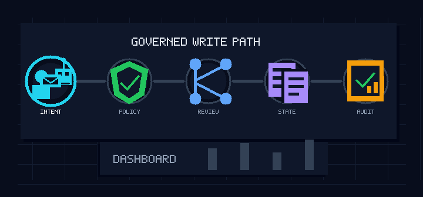

# opra.ai

Free, GitHub-native operating layer for governed business workflows.

opra.ai stores business records as human-readable files, validates them locally, runs governed mutations through RBAC and approval policy, emits audit evidence, and exposes demo workflows through CLI, API, browser UI, GitHub pull requests, and Skills.

This repository is the free developer-preview edition. It is meant for local evaluation, forks, demos, and self-directed experimentation.

<p align="center">
  
</p>

## What You Can Do Today

- Validate CRM source records.
- Inspect source records as JSON.
- Run governed local create, read, update, and delete operations with audit events.
- Create mutation proposal artifacts.
- Validate proposal pull requests with GitHub Actions.
- Map GitHub reviews into approval evidence.
- Generate proposal check reports for Actions summaries.
- Build local CRM dashboard read models.
- Run local CRM Skills.
- Use a local Company OS dashboard with sign-in, registration, startup personas, user administration, customers, delivery, people, governed work changes, approvals, publishing drafts, and activity evidence.
- Create and update mock GitHub Issue previews.
- Publish real proposal PRs and GitHub Issues with `gh` when you choose to use live GitHub integration.

## Current Limits

- The CLI module names are still `company_os_cli` and `company_os_core` during this developer preview.
- Customers has the richest read model today.
- Delivery and People support governed dashboard objects and Workbench changes while more read-model skills are added.
- The browser workspace is local-first and intentionally dependency-free.
- GitHub integration uses the local `git` and `gh` CLIs for live operations.

## Quickstart

```bash
git clone https://github.com/sabbanis/opra.ai.git
cd opra.ai
export PYTHONPATH=packages/company_os_core/src:packages/company_os_cli/src
python3 -m unittest discover -s tests
python3 -m company_os_cli doctor
```

Validate the CRM seed records:

```bash
python3 -m company_os_cli validate --file modules/crm/objects/accounts/acct_acme.yaml
python3 -m company_os_cli validate --file modules/crm/objects/opportunities/opp_acme_renewal_2026.yaml
```

Build the CRM read model and run a Skill:

```bash
python3 -m company_os_cli index-crm
python3 -m company_os_cli crm-skill --name pipeline-summary --user ssabbani --role sales_rep
```

Run the local Company OS dashboard:

```bash
python3 apps/api/server.py --repo-root . --port 8080
```

Open:

```text
http://127.0.0.1:8080/
```

Seeded demo users are in `platform/identity/users.json`. Use UID `owner` with passcode `demo` for full access, or sign in as `customer_operator`, `support_engineer`, or `hiring_manager` to test scoped module views.

## Onboarding Docs

Start here:

- [Getting Started](docs/getting-started.md)
- [Persona Onboarding](docs/persona-onboarding.md)
- [End-to-End Architecture](docs/end-to-end-architecture.md)
- [Threat and Vulnerability Assessment](docs/threat-and-vulnerability-assessment.md)
- [Onboarding Checklist](docs/onboarding-checklist.md)
- [Local Development Setup](docs/local-development.md)
- [First CRM Demo](docs/first-crm-demo.md)
- [Governed Proposal Workflow](docs/governed-proposal-workflow.md)
- [GitHub Integration](docs/github-integration.md)
- [Repository Boundary](docs/repository-boundary.md)
- [Testing Guide](docs/testing-guide.md)
- [Troubleshooting](docs/troubleshooting.md)

## Repository Layout

```text
modules/       Product modules: CRM, Issues, HR
platform/      RBAC, audit, dashboards, GitHub integration, proposals
apps/          Local API, browser UI, workers scaffold
packages/      Shared Python packages
demos/         Seed data, scripts, narratives
docs/          Free onboarding docs
tests/         Unit, integration, and e2e tests
```

## Local Check

Run the current no-dependency test suite:

```bash
PYTHONPATH=packages/company_os_core/src:packages/company_os_cli/src python3 -m unittest discover -s tests
```

Run the CLI doctor command:

```bash
PYTHONPATH=packages/company_os_core/src:packages/company_os_cli/src python3 -m company_os_cli doctor
```

## License

The source code in this repository is licensed under the Apache License 2.0.
See [LICENSE](LICENSE).
