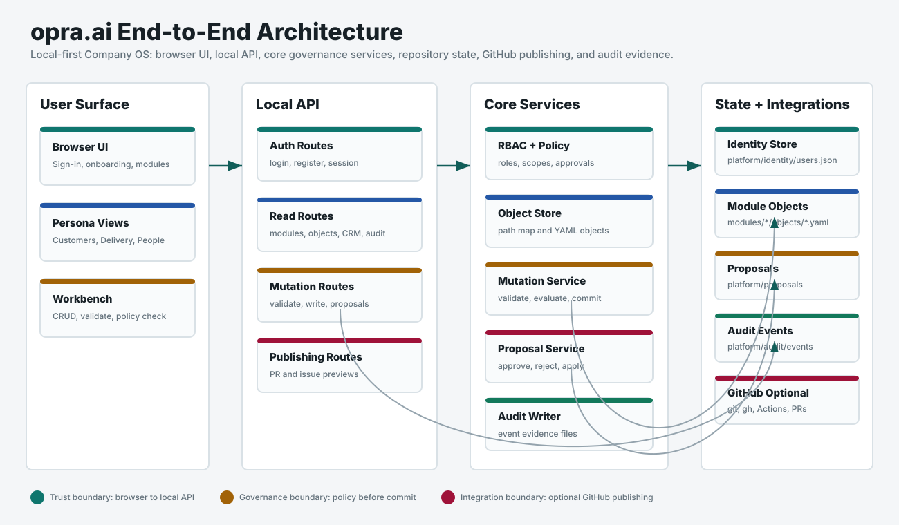

# End-to-End Architecture

This document explains the local opra.ai architecture from browser sign-in through governed work, proposals, publishing drafts, and audit evidence.

## System Shape

opra.ai is local-first. The browser UI talks to a local Python API. The API calls shared core services. Core services read and write human-readable repository files. Optional GitHub workflows can publish proposal and issue drafts.

The current system has four main zones:

- User Surface: browser UI, persona onboarding, module dashboards, and Workbench.
- Local API: authentication routes, read routes, mutation routes, proposal routes, and publishing preview routes.
- Core Services: RBAC, policy, object store, mutation service, proposal service, and audit writer.
- State and Integrations: local identity file, module objects, proposal artifacts, audit events, and optional GitHub tooling.

## Trust Boundaries

Browser to Local API:

- The browser sends requests to `http://127.0.0.1:8080`.
- The browser stores the local session id in local storage.
- Every API route except the HTML, static assets, `/health`, and auth entry points requires a signed-in session.

Local API to Core Services:

- The API does not own business rules.
- The API routes requests into shared core services.
- Policy checks and governed writes happen in core services.

Core Services to Repository State:

- Source records live under `modules/*/objects`.
- Proposals live under `platform/proposals`.
- Audit events live under `platform/audit/events`.
- Identity seed data lives under `platform/identity/users.json`.

Local Repository to GitHub:

- GitHub behavior is optional.
- The preview path writes local draft artifacts first.
- Live GitHub operations use local `git` and `gh` configuration when the user chooses that workflow.

## Request Lifecycle

Sign-in:

1. Browser posts UID and passcode to `/auth/login`.
2. API checks `platform/identity/users.json`.
3. API returns a session id and public user payload.
4. Browser sends `X-Opra-Session` on later API requests.

Read:

1. Browser requests modules, records, CRM summaries, proposals, or activity.
2. API resolves the session to a user.
3. API asks policy whether the user can read the requested object types.
4. API returns only authorized rows.

Governed write:

1. User edits a work item in Workbench.
2. Browser sends the object, action, fields, and request id.
3. Core validation checks schema and domain rules.
4. Policy evaluates role, action, object type, scope, and fields.
5. If allowed, the object store writes the YAML record.
6. Audit writer records the event.
7. Browser renders the result report.

Proposal:

1. User creates a proposal from Workbench.
2. Proposal service records before and after state, policy decision, required approvers, and hashes.
3. Approvers approve, reject, or apply the proposal.
4. Applying a proposal writes the target object only when hashes and policy requirements still match.
5. Audit writer records the applied change.

Publishing:

1. User opens Publishing or an approval request.
2. API creates local PR or issue preview artifacts.
3. Optional live publishing uses local GitHub CLI configuration.

## Data Files

Identity:

- `platform/identity/users.json`
- Seed users and local user-management data.

Customers:

- `modules/crm/objects/accounts`
- `modules/crm/objects/opportunities`

Delivery:

- `modules/issues/objects/components`
- `modules/issues/objects/defects`
- `modules/issues/objects/feature_requests`
- `modules/issues/objects/incidents`
- `modules/issues/objects/rca`
- `modules/issues/objects/releases`

People:

- `modules/hr/objects/candidates`
- `modules/hr/objects/employees`
- `modules/hr/objects/interviews`
- `modules/hr/objects/jobs`
- `modules/hr/objects/offers`
- `modules/hr/objects/onboarding`
- `modules/hr/objects/policy_ack`
- `modules/hr/objects/time_off`

Governance:

- `platform/proposals/mutations`
- `platform/audit/events`
- `platform/integrations/github`

## Current Persona Model

Owner:

- All modules.
- User administration.
- Approval, publishing, and audit access.

Company OS Admin:

- All modules.
- User administration.
- Operational workflow management.

Customer Lead and Customer Operator:

- Customers module.
- Customer Workbench, customer approvals, and customer activity.

Engineering Lead and Support Engineer:

- Delivery module.
- Delivery Workbench, delivery approvals, and delivery activity.

People Ops and Hiring Manager:

- People module.
- People Workbench, People approvals, and People activity.

## Deployment Model

Current state:

- Local Python API.
- Static browser assets served by the API.
- File-backed state in the repository.
- In-memory local sessions.
- No external database.

Expected hardening path:

1. Replace demo passcodes with real credential lifecycle.
2. Move sessions to expiring secure server-side storage.
3. Add audit events for user administration.
4. Add stronger field-level and record-level People data controls.
5. Add tamper-evident audit seals.
6. Add security headers and a browser content policy.
7. Add deployment-specific transport security.
