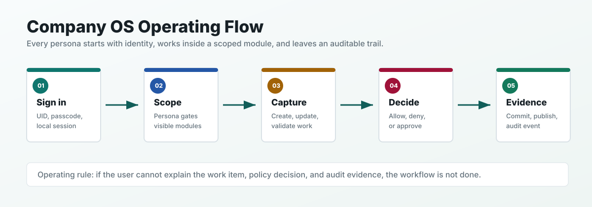

# Persona Onboarding

This guide explains exactly how each local Company OS persona should start, what they can touch, and what a good first session looks like.



## Common First Steps

Every user starts the same way:

1. Start the local API server.

   ```bash
   PYTHONPATH=packages/company_os_core/src:packages/company_os_cli/src python3 apps/api/server.py --repo-root . --port 8080
   ```

2. Open the browser dashboard.

   ```text
   http://127.0.0.1:8080/
   ```

3. Sign in with the UID for your persona.

4. Use passcode `demo` for seeded demo users.

5. Read the Onboarding tab before changing work items.

6. Use Workbench for create, update, validate, policy check, proposal, and delete actions.

7. Use Activity to confirm important work left evidence.

## Owner

Seed user: `owner`

What this persona owns:

- Full Company OS access.
- User setup and persona assignment.
- All modules: Customers, Delivery, and People.
- Approval, publishing, and evidence review.

First session:

1. Sign in with UID `owner` and passcode `demo`.
2. Open Users.
3. Confirm the seeded users exist: `admin`, `customer_lead`, `customer_operator`, `engineering_lead`, `support_engineer`, `people_ops`, and `hiring_manager`.
4. Add one test user only if you need to verify user creation.
5. Open Home.
6. Read Needs Attention, Approvals, and Recent Activity.
7. Open Customers, Delivery, and People once each.
8. Open Workbench.
9. Create one safe test work item.
10. Open Activity and confirm the work item produced evidence.

Boundaries:

- Do not use demo users for real company data.
- Do not grant Owner unless the person truly owns system decisions.
- Treat People records as sensitive.

You are ready when:

- You can explain which personas can access which modules.
- You can add a user and choose the right persona.
- You can find the audit event for a completed change.

## Company OS Admin

Seed user: `admin`

What this persona owns:

- System setup and day-to-day workspace operation.
- User management, local workflow checks, approval review, and publishing drafts.

First session:

1. Sign in with UID `admin` and passcode `demo`.
2. Open Users.
3. Confirm each user has exactly one persona.
4. Open Home.
5. Check whether any approvals are waiting.
6. Open Workbench.
7. Load an existing work item without changing it.
8. Run Validate.
9. Open Activity and confirm history is readable.

Boundaries:

- Do not grant broad access as a convenience.
- Do not bypass Workbench for governed business changes.
- Do not publish a draft before checking proposal status.

You are ready when:

- Every user has a named persona.
- You know how to validate a work item.
- You know where publishing drafts and audit evidence live.

## Customer Lead

Seed user: `customer_lead`

What this persona owns:

- Customer health.
- Customer pipeline.
- Renewal risk.
- Customer approvals.

First session:

1. Sign in with UID `customer_lead` and passcode `demo`.
2. Open Customers.
3. Read the customer table from left to right: name, stage, health, ARR, renewal, pipeline.
4. Check the metric tiles at the top.
5. Open Workbench.
6. Use only Account or Opportunity work item types.
7. Open Approvals.
8. Check whether customer work needs your decision.
9. Open Activity and verify customer work is visible.

Boundaries:

- Do not create Delivery records.
- Do not create People records.
- Do not manage users.

You are ready when:

- You can identify the customer needing follow-up.
- You can identify the highest value open opportunity.
- You can approve or reject a customer change with a reason.

## Customer Operator

Seed user: `customer_operator`

What this persona owns:

- Customer account updates.
- Opportunity updates.
- Customer work proposals.

First session:

1. Sign in with UID `customer_operator` and passcode `demo`.
2. Open Customers.
3. Find Acme Corp.
4. Open Workbench.
5. Choose Opportunity.
6. Review every generated field before saving.
7. Run Validate.
8. Run Policy Check.
9. Create a proposal if policy requires approval.
10. Open Activity and confirm your work is visible.

Boundaries:

- Do not use Users.
- Do not use Delivery or People.
- Do not use Publishing.
- Do not change system settings.

You are ready when:

- You can create a customer opportunity proposal.
- You can explain the policy result.
- You can find your work in Activity.

## Engineering Lead

Seed user: `engineering_lead`

What this persona owns:

- Delivery work.
- Defects.
- Incidents.
- Releases.
- Engineering evidence.

First session:

1. Sign in with UID `engineering_lead` and passcode `demo`.
2. Open Delivery.
3. Review defects, incidents, releases, and RCAs.
4. Open Workbench.
5. Choose Defect, Incident, or Release.
6. Create one safe delivery work item.
7. Review the policy decision.
8. Open Activity and confirm the delivery event is visible.

Boundaries:

- Do not manage users.
- Do not create Customer records.
- Do not create People records.

You are ready when:

- Delivery work is visible and current.
- Release readiness is captured in a governed record.
- Incident or defect changes leave audit evidence.

## Support Engineer

Seed user: `support_engineer`

What this persona owns:

- Support defects.
- Support incidents.
- RCA evidence.
- Clear next steps.

First session:

1. Sign in with UID `support_engineer` and passcode `demo`.
2. Open Delivery.
3. Read the current work list.
4. Open Workbench.
5. Choose Defect or Incident.
6. Fill in severity, state, owner team, and next step.
7. Run Validate.
8. Create the work item if validation passes.
9. Open Activity and confirm the support event exists.

Boundaries:

- Do not create releases.
- Do not work in Customers.
- Do not work in People.
- Do not put real customer-sensitive details in demo records.

You are ready when:

- A support item has severity, state, owner team, and next step.
- The item validates cleanly.
- The event is visible in Activity.

## People Ops

Seed user: `people_ops`

What this persona owns:

- Hiring operations.
- Onboarding.
- Employee changes.
- Policy acknowledgments.
- Time off.

First session:

1. Sign in with UID `people_ops` and passcode `demo`.
2. Open People.
3. Review jobs, candidates, employees, onboarding, and time off.
4. Open Workbench.
5. Choose Job, Candidate, Employee, or Time Off.
6. Review visibility before saving.
7. Run Validate.
8. Open Activity and confirm People work is recorded.

Boundaries:

- Treat People records as sensitive.
- Do not create Customer records.
- Do not create Delivery records.
- Do not manage users.

You are ready when:

- People work is captured with the right state and next step.
- Sensitive records use the right visibility.
- You can trace the request in Activity.

## Hiring Manager

Seed user: `hiring_manager`

What this persona owns:

- Open roles.
- Candidates.
- Interviews.
- Offers.
- Onboarding requests.

First session:

1. Sign in with UID `hiring_manager` and passcode `demo`.
2. Open People.
3. Focus on jobs, candidates, interviews, offers, and onboarding.
4. Open Workbench.
5. Choose Job or Candidate.
6. Fill in stage, source, and next step.
7. Run Validate.
8. Save or propose the change.
9. Open Activity and confirm hiring work is recorded.

Boundaries:

- Do not manage system users.
- Do not change Customer records.
- Do not change Delivery records.
- Do not put real candidate personal data into demo records.

You are ready when:

- A hiring item has a clear stage and next step.
- The hiring item validates cleanly.
- The hiring action is visible in Activity.
